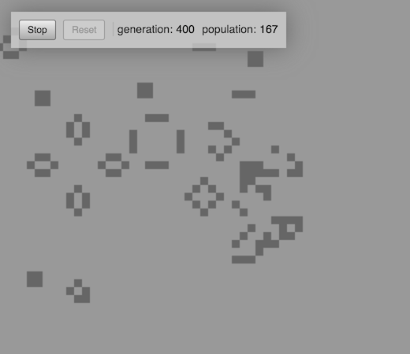

# Game of Life (Javascript edition)

An attempt to implement Conway's Game of Life using functional Javascript. 

Feedback welcomed!

Usage:

`npm test` to run the tests using Jasmine.

To play the game open the `index.html` file in a web browser, then click to draw cells in the desired positions. You may also click/drag to draw many cells at once. Once you have seeded the world, kick off the game by pressing the 'Run' button.

